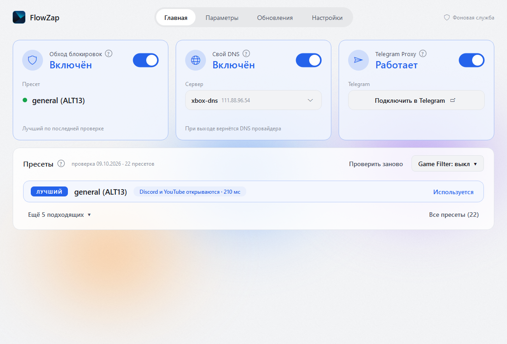
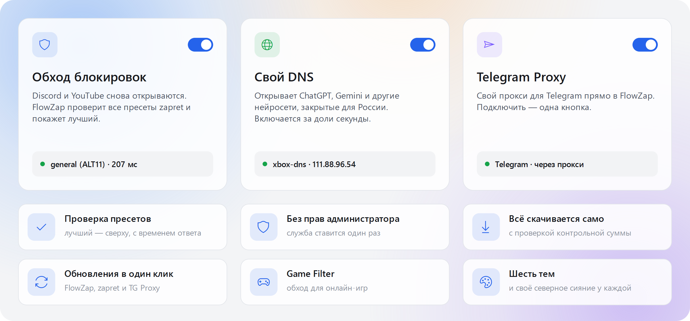
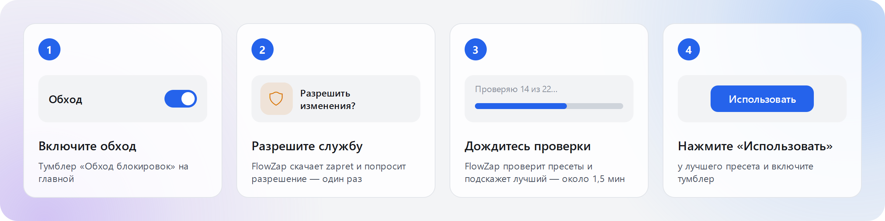
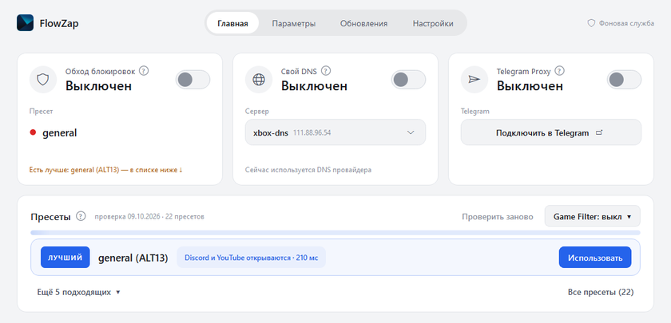
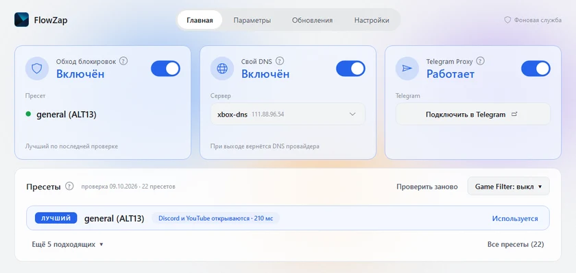
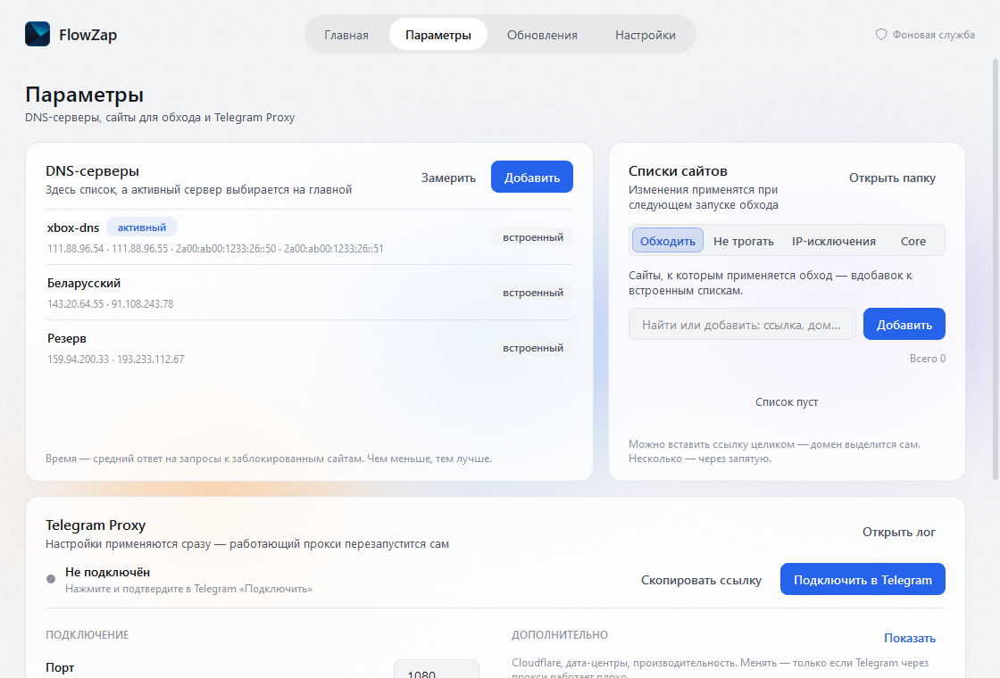
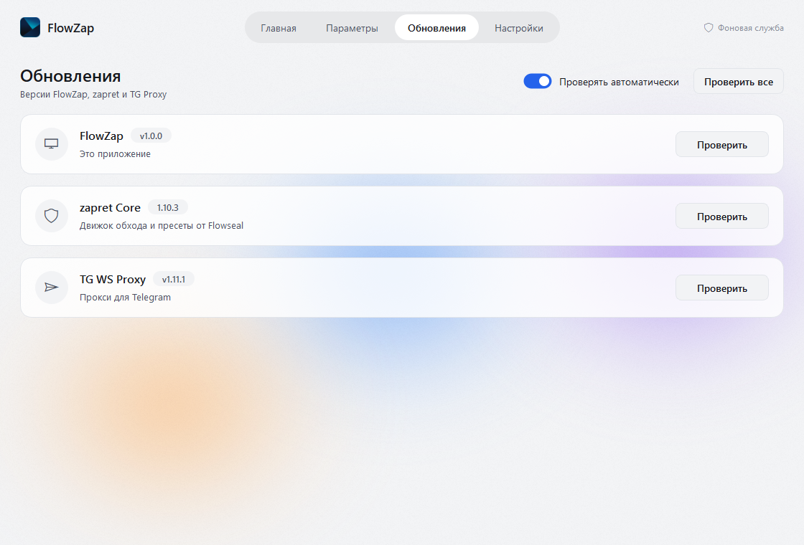
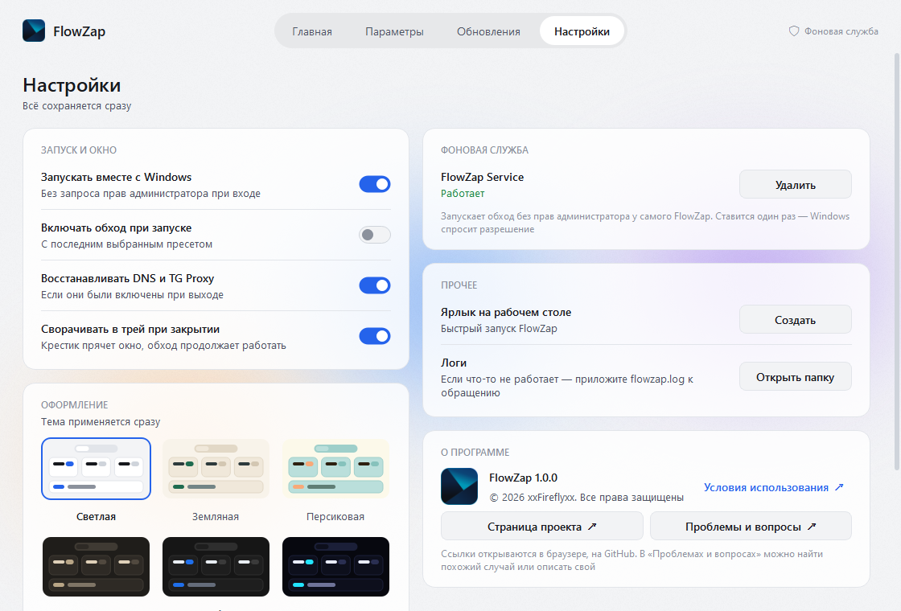

 

**Русский** · [English](#english)

FlowZap — приложение для Windows, которое возвращает Discord и YouTube, подключает Telegram через прокси и открывает нейросети — ChatGPT, Gemini и другие сервисы, которые сами закрыли доступ из России. Внутри — проверенный обход [Flowseal/zapret-discord-youtube](https://github.com/Flowseal/zapret-discord-youtube) и [Flowseal/tg-ws-proxy](https://github.com/Flowseal/tg-ws-proxy), а снаружи — три плитки и пара кликов. Ни консоли, ни `.bat`-файлов, ни ручной настройки.

<picture>
  <source media="(prefers-color-scheme: dark)" srcset="docs/screenshots/home-dark.png">
  
</picture>

> [!NOTE]
> FlowZap активно развивается. Что-то не работает — [напишите в Issues](../../issues/new), это очень помогает.

---

## ✨ Что умеет

<picture>
  <source media="(prefers-color-scheme: dark)" srcset="docs/features-dark.png">
  
</picture>

Подробнее о возможностях

 

- 🔍 **Проверка пресетов** — FlowZap по очереди пробует каждый пресет и показывает результат цветом: 🟢 работает · 🟡 частично · 🔴 не работает. Лучший — сверху, с временем ответа.
- 🔐 **Без прав администратора** — один раз ставится фоновая служба FlowZap Service (одно окно Windows), дальше FlowZap запускается как обычная программа.
- ⬇️ **Всё скачивается само** — при первом нажатии «Включить» FlowZap загрузит zapret и проверит файлы по контрольной сумме.
- 🔄 **Обновления в один клик** — FlowZap, zapret и TG Proxy обновляются на вкладке «Обновления». Если загрузка с GitHub упёрлась в лимит из-за DNS, FlowZap сам повторит её без него.
- 💾 **Помнит, что было включено** — после перезагрузки Windows обход, DNS и прокси вернутся как были.
- 🎮 **Game Filter** — обход для онлайн-игр: TCP, UDP или оба.
- 📱 **Прокси для телефона** — телефон в той же Wi-Fi сети может пользоваться прокси компьютера.
- 🎨 **Шесть тем** — Светлая, Земляная, Персиковая, Тёмная, Карбон и Неон, у каждой своё «северное сияние» на фоне.
- 🚀 **Автозапуск с Windows** и сворачивание в трей.

---

## 📥 Установка

1. Скачайте архив `FlowZap-vX.X.X.zip` со страницы **[Releases](https://github.com/xxFireflyxx/FlowZap-Zapret-GUI/releases/latest)**.
2. Распакуйте его в любую папку, например `C:\FlowZap` — не на рабочий стол внутри архива.
3. Запустите **`FlowZap.exe`**. Права администратора не нужны.

> [!TIP]
> Windows SmartScreen может показать «Windows защитила ваш компьютер» — у FlowZap пока нет платной цифровой подписи. Нажмите **Подробнее → Выполнить в любом случае**.

**Требования:** Windows 10 или 11 (64-бит), интернет для первой загрузки zapret.

> [!NOTE]
> **🛡️ Безопасность.** Kaspersky проверил FlowZap, в том числе запустив его в песочнице: **«Безопасный объект»** — угроз и подозрительных действий не найдено. [Отчёт Kaspersky OpenTIP](https://opentip.kaspersky.com/37F3E4655724E62B4A34980A56DBECA5EE081F62A4DDD49848E8D39615837ACB/results?tab=upload)

---

## 🚀 Первый запуск

<picture>
  <source media="(prefers-color-scheme: dark)" srcset="docs/steps-dark.png">
  
</picture>

1. **Нажмите тумблер «Обход блокировок»** на главной — FlowZap скачает zapret.
2. Затем он **сам проверит пресеты и подскажет лучший** — около полутора минут, ход видно по полосе в блоке «Пресеты». В начале Windows один раз спросит разрешение на установку **фоновой службы** (окно UAC) — согласитесь. Больше это окно появляться не будет.
3. Когда проверка закончится, у лучшего пресета нажмите **«Использовать»** и включите тумблер ещё раз.
4. Готово — Discord и YouTube открываются. В следующий раз хватит одного тумблера, а можно и вовсе включить обход при запуске в **Настройках**.

 Проверка пресетов (ускорено — на деле около 1,5 мин)

### Свой DNS и нейросети
Включите тумблер **«Свой DNS»** на главной — и откроются нейросети и сервисы, которые сами ограничили доступ из России: ChatGPT, Gemini и другие. Это делают встроенные DNS-серверы (xbox-dns и другие): для таких сервисов они пропускают запросы через себя. Сервер выбирается во вкладке **Параметры → DNS-серверы**: там встроенные серверы и время их ответа, можно добавить свой. При выходе из FlowZap возвращается DNS провайдера.

### Telegram Proxy
1. Включите тумблер **«Telegram Proxy»** на главной.
2. Нажмите **«Подключить в Telegram»** — Telegram откроется и предложит добавить прокси. Нажмите «Подключить».
3. На плитке появится зелёная точка — Telegram работает через прокси.

Порт, секрет, прокси для телефона и дополнительные настройки — во вкладке **Параметры → Telegram Proxy**.

---

## 🖼️ Интерфейс

 Шесть тем: Светлая, Тёмная, Земляная, Карбон, Персиковая и Неон

<table>
<tr>
<td align="center"><b>Параметры</b></td>
<td align="center"><b>Обновления</b></td>
</tr>
<tr>
<td width="50%">

<picture>
  <source media="(prefers-color-scheme: dark)" srcset="docs/screenshots/parameters-dark.png">
  
</picture>

</td>
<td width="50%">

<picture>
  <source media="(prefers-color-scheme: dark)" srcset="docs/screenshots/updates-dark.png">
  
</picture>

</td>
</tr>
<tr>
<td align="center"><b>Настройки</b></td>
<td align="center"><b>Главная</b></td>
</tr>
<tr>
<td width="50%">

<picture>
  <source media="(prefers-color-scheme: dark)" srcset="docs/screenshots/settings-dark.png">
  
</picture>

</td>
<td width="50%">

<picture>
  <source media="(prefers-color-scheme: dark)" srcset="docs/screenshots/home-dark.png">
  
</picture>

</td>
</tr>
</table>

| Вкладка | Что там |
|---|---|
| **Главная** | Три плитки — обход, DNS, Telegram Proxy — и блок «Пресеты» с лучшим пресетом и проверкой |
| **Параметры** | DNS-серверы, списки сайтов для обхода, настройки Telegram Proxy |
| **Обновления** | FlowZap, zapret и TG Proxy: версия, что нового, обновить |
| **Настройки** | Тема, автозапуск, трей, фоновая служба, ярлык, логи |

---

## ❓ Частые вопросы

<b>Discord или YouTube всё равно не открываются</b>

 

Нажмите **«Проверить заново»** в блоке «Пресеты» — провайдеры меняют блокировки, и лучший пресет со временем может смениться. Если ни один не работает — обновите zapret во вкладке «Обновления»: Flowseal регулярно выпускает новые пресеты.

<b>Как открываются ChatGPT, Gemini и другие нейросети?</b>

 

Их блокирует не провайдер, а сами сервисы — по стране. Обход zapret тут не поможет, а **свой DNS** поможет: встроенные серверы FlowZap (xbox-dns и другие) подставляют для таких сайтов свои адреса и пропускают запросы через себя. Включите тумблер «Свой DNS» на главной. Какие именно сервисы открываются — решает выбранный DNS-сервер; если какой-то не открылся, попробуйте другой во вкладке **Параметры → DNS-серверы**.

<b>Зачем фоновая служба и безопасно ли это?</b>

 

Обход (WinDivert) и смена DNS требуют прав администратора. Чтобы не запускать FlowZap от администратора каждый раз, их выполняет маленькая служба **FlowZap Service**. Она умеет только это: запустить или остановить обход, поменять или сбросить DNS, обновить свой zapret с GitHub (со сверкой контрольной суммы). Других программ она не запускает. Удалить её можно в **Настройках** одной кнопкой.

<b>Антивирус ругается на FlowZap или zapret</b>

 

Microsoft Defender, Kaspersky, ESET, Dr.Web и другие крупные антивирусы FlowZap не трогают. Но бывает два вида срабатываний — оба не значат, что внутри вирус:

- **Эвристика.** Некоторые антивирусы проверяют не по базе вирусов, а «по признакам»: неподписанная программа, которая запускает службу и меняет сетевые настройки, кажется им подозрительной. На [VirusTotal](https://www.virustotal.com/gui/file/37f3e4655724e62b4a34980a56dbeca5ee081f62a4ddd49848e8d39615837acb) так реагируют несколько антивирусов из ~70 — небольшие или эвристические движки; названия угроз у них бывают случайными и меняются от проверки к проверке.
- **zapret.** Сам FlowZap драйверов не содержит — обход делает zapret от Flowseal, который FlowZap скачивает при первом запуске. В него входит драйвер WinDivert, и некоторые антивирусы относят его к «потенциально опасным инструментам» (например, `Not-a-virus:RiskTool…WinDivert`): он умеет перехватывать сетевой трафик, а для обхода это и нужно. Так антивирусы реагируют на zapret и без FlowZap.

Если антивирус удалил файл или мешает запуску — добавьте папку с FlowZap в исключения антивируса — например, `C:\FlowZap`, если вы распаковали его туда. Код FlowZap открыт: его можно посмотреть в этом репозитории.

<b>Не работают онлайн-игры</b>

 

Включите **Game Filter** в шапке блока «Пресеты»: TCP — для игр с подключением по TCP, UDP — для большинства онлайн-игр и голоса, «TCP и UDP» — максимальный охват.

<b>Как перенести настройки или удалить FlowZap?</b>

 

Все настройки — в файле `config.toml` рядом с `FlowZap.exe`. Чтобы удалить FlowZap: в **Настройках** удалите фоновую службу, выключите автозапуск, затем удалите папку с программой.

<b>Где логи, если нужно сообщить об ошибке?</b>

 

**Настройки → Логи → Открыть папку** — откроется папка `logs` с выделенным файлом `flowzap.log`. Приложите его к [Issue](../../issues/new).

---

## 🙏 Благодарности

- [Flowseal](https://github.com/Flowseal) — за [zapret-discord-youtube](https://github.com/Flowseal/zapret-discord-youtube) и [tg-ws-proxy](https://github.com/Flowseal/tg-ws-proxy)
- [bol-van](https://github.com/bol-van) — за [zapret](https://github.com/bol-van/zapret), на котором всё построено
- [medvedeff-true](https://github.com/medvedeff-true) — за игровые списки доменов и IP ([ru-gaming-blocklist](https://github.com/medvedeff-true/ru-gaming-blocklist))

---

## 📄 Лицензия

**© 2026 [xxFireflyxx](https://github.com/xxFireflyxx). Все права защищены** — полные условия в файле [LICENSE](LICENSE).

- ✅ Можно бесплатно скачивать FlowZap отсюда или с [GitLab](https://gitlab.com/xx_firefly_xx/flowzap), пользоваться им и делиться ссылкой
- ✅ Можно смотреть код и изучать, как всё устроено
- ❌ Нельзя без разрешения автора копировать код, выкладывать свои сборки и изменённые версии, зарабатывать на программе

Вдохновились идеей и пишете своё? Будет приятно, если упомянете FlowZap в своём README 🙂

⭐ **Если FlowZap помог — поставьте звезду, это лучшая мотивация развивать проект!**

---

## 🇬🇧 English

FlowZap is a Windows app that brings back Discord and YouTube, connects Telegram through a proxy and opens AI services such as ChatGPT and Gemini that block Russia themselves. Under the hood it runs the proven [Flowseal/zapret-discord-youtube](https://github.com/Flowseal/zapret-discord-youtube) bypass and [Flowseal/tg-ws-proxy](https://github.com/Flowseal/tg-ws-proxy); on the surface — three tiles and a couple of clicks. No console, no `.bat` files. The interface is in Russian.

### Features

- 🛡️ **Block bypass** — FlowZap tests every zapret preset, ranks them by result and speed, and enables the best one.
- 🌐 **Custom DNS** — opens ChatGPT, Gemini and other AI services that geo-block Russia; one switch, applied in a fraction of a second.
- ✈️ **Telegram Proxy** — built into FlowZap, no extra apps or tray icons; connect Telegram with one button.
- 🔐 **No admin rights** — a small background service (FlowZap Service) is installed once with a single UAC prompt.
- ⬇️ **Downloads everything itself** — zapret is fetched and checksum-verified on first start.
- 🔄 **One-click updates** for FlowZap, zapret and TG Proxy.
- 💾 **Restores state** after a Windows reboot; 🎮 **Game Filter**; 📱 **proxy for your phone**; 🎨 **six themes**, each with its own live aurora background.

### Installation

1. Download `FlowZap-vX.X.X.zip` from **[Releases](https://github.com/xxFireflyxx/FlowZap-Zapret-GUI/releases/latest)**.
2. Extract it to any folder, e.g. `C:\FlowZap`.
3. Run **`FlowZap.exe`** — no administrator rights needed.
4. Turn on **«Обход блокировок»** (Block bypass). FlowZap downloads zapret and tests the presets (~1.5 min); accept the one-time background service prompt. Then click **«Использовать»** (Use) on the best preset and turn the switch on again.

If SmartScreen warns you, click **More info → Run anyway** — FlowZap has no paid code-signing certificate yet.

🛡️ Kaspersky rates FlowZap as a **safe object**, including a sandbox run: [Kaspersky OpenTIP report](https://opentip.kaspersky.com/37F3E4655724E62B4A34980A56DBECA5EE081F62A4DDD49848E8D39615837ACB/results?tab=upload).

**Requirements:** Windows 10 or 11 (64-bit).

### License

**© 2026 [xxFireflyxx](https://github.com/xxFireflyxx). All rights reserved** — see [LICENSE](LICENSE). You may download FlowZap for free from here or [GitLab](https://gitlab.com/xx_firefly_xx/flowzap), use it, share the link and read the code. Copying the code, publishing your own builds or modified versions, or making money from the program requires the author's permission.
